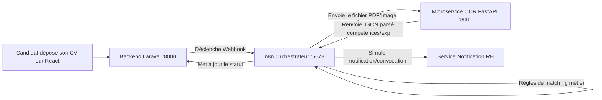

# 📘 Documentation Complète & Projet Pratique n8n (100% Hors Connexion)

> **Projet : Plateforme de Recrutement AlpA Ciment**  
> **Technologies :** n8n (Docker), FastAPI (Python local), 100% Localhost sans connexion Internet.

---

## Table des Matières
1. [Qu'est-ce que n8n et comment ça fonctionne ?](#1-quest-ce-que-n8n-et-comment-ça-fonctionne-)
2. [Structure des données dans n8n (Le format JSON Item)](#2-structure-des-données-dans-n8n-le-format-json-item)
3. [Les Nœuds fondamentaux de n8n](#3-les-nœuds-fondamentaux-de-n8n)
4. [Règle d'or du Réseau Docker : Conteneur vers Machine Hôte](#4-règle-dor-du-réseau-docker--conteneur-vers-machine-hôte)
5. [Projet Pratique : Triage Automatisé des Candidats avec FastAPI](#5-projet-pratique--triage-automatisé-des-candidats-avec-fastapi)
   - [A. Démarrer l'API FastAPI](#a-démarrer-lapi-fastapi)
   - [B. Méthode 1 : Importer le Workflow en 1 clic](#b-méthode-1--importer-le-workflow-en-1-clic)
   - [C. Méthode 2 : Construire le Workflow pas à pas](#c-méthode-2--construire-le-workflow-pas-à-pas)
   - [D. Exécution et observation en direct](#d-exécution-et-observation-en-direct)
6. [Intégration avec votre soutenance (Laravel + OCR FastAPI)](#6-intégration-avec-votre-soutenance-laravel--ocr-fastapi)

---

## 1. Qu'est-ce que n8n et comment ça fonctionne ?

**n8n** est un orchestrateur de workflows open-source ("workflow automation tool"). Il permet de connecter différentes applications, microservices et bases de données entre elles sans écrire de code d'intégration lourd.

### Les concepts clés :
- **Workflow** : Un processus complet constitué d'une suite d'étapes ordonnées.
- **Nœud (Node)** : Une étape individuelle du workflow. Il existe deux catégories de nœuds :
  1. **Triggers (Déclencheurs)** : Le point d'entrée qui démarre le workflow (ex: réception d'un Webhook, planification chronologique, déclenchement manuel).
  2. **Actions** : Les étapes qui réalisent une tâche (ex: appeler une API REST avec `HTTP Request`, filtrer avec `If`, transformer des données avec `Code`).
- **Connexions** : Les flèches reliant les nœuds. Elles transportent les données d'un nœud vers le nœud suivant.

---

## 2. Structure des données dans n8n (Le format JSON Item)

Dans n8n, les données circulent sous la forme d'un tableau d'objets, chaque objet ayant une propriété `json` :

```json
[
  {
    "json": {
      "id": 1,
      "nom": "Jean Rakoto",
      "poste": "Développeur Fullstack",
      "score": 85
    }
  },
  {
    "json": {
      "id": 2,
      "nom": "Marie Rasoa",
      "poste": "Développeur Fullstack",
      "score": 45
    }
  }
]
```

### 💡 Le comportement en boucle automatique (Batch loop)
Si un nœud reçoit un tableau contenant 3 candidats, le nœud suivant (par exemple `HTTP Request`) **s'exécutera automatiquement 3 fois**, une fois pour chaque candidat, sans que vous n'ayez besoin de créer une boucle `for` manuellement !

### 💡 Les expressions dynamiques dans n8n
Pour utiliser la valeur d'un champ dans un nœud, n8n utilise des doubles accolades `{{ ... }}` :
- `{{ $json.nom }}` : Récupère la valeur `nom` de l'élément en cours de traitement.
- `{{ $json.score >= 70 }}` : Évalue une condition booléenne.
- `{{ $('Nom du Nœud').item.json.email }}` : Récupère la valeur issue d'un nœud précédent.

---

## 3. Les Nœuds fondamentaux de n8n

| Nœud | Rôle | Exemple d'utilisation |
|---|---|---|
| **Webhook** | Écoute une requête HTTP entrante (GET/POST) | Déclenché par Laravel lorsqu'un candidat soumet son CV |
| **HTTP Request** | Effectue une requête HTTP sortante (GET, POST, PUT, DELETE) | Appelle votre API FastAPI `/api/evaluer-candidat` ou `/extract-cv` |
| **If** | Aiguille les données selon une condition booléenne (Vrai / Faux) | Si `decision == 'RETENU'` -> Branche Vrai, sinon Branche Faux |
| **Switch** | Aiguille les données selon plusieurs règles (équivalent du `switch/case`) | Selon le type de contrat (`CDI`, `CDD`, `Stage`) |
| **Code (JS/Python)** | Exécute du code sur-mesure | Calculer une moyenne, agréger une liste, formater un texte complexe |
| **Edit Fields (Set)** | Ajoute, modifie ou supprime des champs JSON | Préparer un payload propre avant de l'envoyer à une API |
| **Respond to Webhook** | Renvoie une réponse HTTP immédiate à l'appelant du Webhook | Répondre à React ou Laravel avec `{ "statut": "reçu" }` |
| **Schedule Trigger** | Déclenche le workflow à intervalle régulier (CRON) | Tourner toutes les nuits à 23h pour traiter les candidatures du jour |

---

## 4. Règle d'or du Réseau Docker : Conteneur vers Machine Hôte

C'est l'erreur numéro 1 des développeurs débutant avec n8n sous Docker !

> [!WARNING]
> Lorsque n8n tourne dans un conteneur Docker, **`http://localhost:8000` fait référence à l'intérieur du conteneur n8n lui-même**, et NON à votre machine Windows où tourne FastAPI !

### 🔑 La solution :
Pour appeler depuis n8n une API tournant sur votre machine locale (FastAPI sur le port 8000) :
- ❌ **Ne pas utiliser :** `http://localhost:8000/api/...`
- ✅ **Toujours utiliser :** `http://host.docker.internal:8000/api/...`

L'alias spécial `host.docker.internal` est déjà configuré dans notre [docker-compose.yml](file:///c:/Users/Strix/OneDrive/Documents/itu/itu_s6/Projet_Soutenance/recrutement_alpaCiment/automatisation/docker-compose.yml).

---

## 5. Projet Pratique : Triage Automatisé des Candidats avec FastAPI

Dans ce projet de test :
1. FastAPI expose une liste de candidats en attente de qualification.
2. n8n récupère ces profils.
3. n8n envoie chaque profil à l'algorithme d'évaluation FastAPI.
4. Si le candidat obtient un score >= 70/100 :
   - Son statut passe à `RETENU_POUR_ENTRETIEN`.
   - Une convocation d'entretien est simulée et enregistrée.
5. Si le candidat obtient un score < 70/100 :
   - Son statut passe à `REFUSE`.
   - Un e-mail de refus courtois est simulé et enregistré.
6. Un nœud de code JavaScript génère la synthèse globale du traitement.

---

### A. Démarrer l'API FastAPI

Ouvrez un terminal dans le dossier `automatisation/projet_test_fastapi` et lancez :

```powershell
python app.py
```

L'API démarre sur `http://localhost:8000`.
- Vous pouvez vérifier la documentation interactive Swagger sur : **[http://localhost:8000/docs](http://localhost:8000/docs)**
- Vous pouvez tester le endpoint racine : **[http://localhost:8000/](http://localhost:8000/)**

---

### B. Méthode 1 : Importer le Workflow en 1 clic

Un fichier de workflow prêt à l'emploi a été généré : [workflow_triage_candidats_n8n.json](file:///c:/Users/Strix/OneDrive/Documents/itu/itu_s6/Projet_Soutenance/recrutement_alpaCiment/automatisation/projet_test_fastapi/workflow_triage_candidats_n8n.json).

1. Ouvrez n8n dans votre navigateur : **[http://localhost:5678](http://localhost:5678)**
2. Créez un nouveau workflow (cliquez sur **Add workflow**).
3. Cliquez sur le menu avec les **3 petits points `...` en haut à droite** de l'écran n8n.
4. Cliquez sur **Import from File** et sélectionnez le fichier `workflow_triage_candidats_n8n.json` (ou copiez-collez son contenu directement sur la grille avec `Ctrl+V`).
5. Le schéma complet avec tous les nœuds configurés apparaît instantanément !

---

### C. Méthode 2 : Construire le Workflow pas à pas

Si vous souhaitez le recréer vous-même pour vous entraîner :

#### Nœud 1 : Déclencheur
- Cherchez **Manual Trigger** ("When clicking ‘Test workflow’").

#### Nœud 2 : Récupération des candidats
- Ajoutez un nœud **HTTP Request** :
  - **Method** : `GET`
  - **URL** : `http://host.docker.internal:8000/api/candidats/en-attente`
  - Renommez le nœud : `1. Récupérer Candidats en Attente`

#### Nœud 3 : Évaluation par FastAPI
- Reliez le nœud 2 à un nouveau nœud **HTTP Request** :
  - **Method** : `POST`
  - **URL** : `http://host.docker.internal:8000/api/evaluer-candidat`
  - **Send Body** : Activé
  - **Body Content Type** : `JSON`
  - **Specify Body** : `Using JSON`
  - **JSON** : `={{ JSON.stringify($json) }}`
  - Renommez le nœud : `2. Évaluer Candidat (FastAPI)`

#### Nœud 4 : Condition de Triage
- Ajoutez un nœud **If** relié au nœud 3 :
  - **Condition** : String
  - **Value 1** : `={{ $json.decision }}`
  - **Operation** : `equal`
  - **Value 2** : `RETENU`
  - Renommez le nœud : `3. Retenu (Score >= 70) ?`

#### Nœud 5A (Branche VRAI) : Validation
- Nœud **HTTP Request** sur la sortie `true` :
  - **Method** : `POST`
  - **URL** : `=http://host.docker.internal:8000/api/candidats/{{ $json.candidat_id }}/statut`
  - **Body** (JSON) :
    ```json
    {
      "nouveau_statut": "RETENU_POUR_ENTRETIEN",
      "remarque": "Qualification automatique via n8n"
    }
    ```
- Suivi d'un autre nœud **HTTP Request** pour simuler l'e-mail de convocation :
  - **URL** : `http://host.docker.internal:8000/api/notifications/envoyer`
  - **Body** (JSON) avec les coordonnées du candidat.

#### Nœud 5B (Branche FAUX) : Refus
- Répéter la même démarche sur la sortie `false` avec `nouveau_statut: "REFUSE"` et envoi de l'e-mail de rejet courtois.

#### Nœud 6 : Synthèse en Code JavaScript
- Ajoutez un nœud **Code** (JavaScript) :
  ```javascript
  const items = $input.all();
  return [{
    json: {
      date_execution: new Date().toISOString(),
      total_traites: items.length,
      statut: "Workflow exécuté avec succès"
    }
  }];
  ```

---

### D. Exécution et observation en direct

1. Assurez-vous que `python app.py` tourne dans votre terminal.
2. Dans n8n, cliquez sur le bouton **Test workflow** (ou **Execute workflow**).
3. Observez l'exécution :
   - Chaque nœud devient vert avec une coche ✅.
   - Vous pouvez cliquer sur chaque nœud pour inspecter en direct les données en entrée (**INPUT**) et les données en sortie (**OUTPUT**).
4. Vérifiez dans votre navigateur :
   - Ouvrez [http://localhost:8000/api/candidats](http://localhost:8000/api/candidats) : les statuts ont été mis à jour (`RETENU_POUR_ENTRETIEN` pour les profils qualifiés, `REFUSE` pour les autres).
   - Ouvrez [http://localhost:8000/api/notifications/boite-envois](http://localhost:8000/api/notifications/boite-envois) : tous les e-mails simulés envoyés sont répertoriés avec leur date et contenu.
5. Pour rejouer le test à volonté :
   - Faites un `POST http://localhost:8000/api/reinitialiser` (depuis Swagger ou n8n) et relancez !

---

## 6. Intégration avec votre soutenance (Laravel + OCR FastAPI)

Ce projet de test pose les bases exactes de l'architecture finale de votre soutenance :



Vous disposez maintenant d'un environnement maîtrisé, testable à l'infini en local, sans dépendance à Internet et prêt pour vos démonstrations en soutenance.
